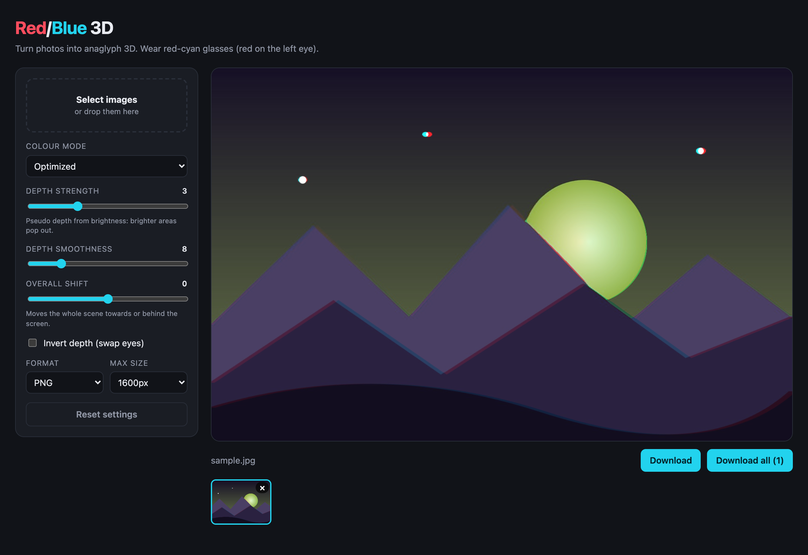

# Red/Blue 3D

A local web app (React + Node.js) that turns ordinary photos into red/cyan anaglyph 3D images. Select one or many images, tweak the depth, and download the results. Everything runs on your machine, and nothing is uploaded anywhere.



## Quick start

Requires Node.js 18+.

```bash
npm install
npm start
```

Then open <http://localhost:5174>. `npm start` builds the React client and serves it, along with the API, from one Node process bound to `127.0.0.1`.

Put on red-cyan glasses (red lens over the left eye) to view the result.

## Features

- Select multiple images at once, or drag and drop them
- Live preview that re-renders as you change settings
- Colour modes: Optimized, Color, Half color, Gray, True red/blue
- **Depth strength / smoothness**: a pseudo depth map is derived from image brightness, so brighter areas pop out
- **Overall shift**: moves the whole scene toward or behind the screen
- Invert depth (swap eyes)
- PNG or JPEG output with a max-size limit
- Download one image or all of them

## How it works

For each pixel a horizontal disparity is computed from a blurred grayscale depth map plus the global shift. The left-eye and right-eye views are sampled at opposite offsets and combined into one image, with the red channel from the left view and green/blue from the right view. The exact mix depends on the colour mode. The depth is a heuristic, not real depth estimation, so results vary by photo: high-contrast subjects on plain backgrounds work best.

## Development

```bash
npm run dev
```

This runs the API on port 5174 and Vite with hot reload on <http://localhost:5173> (`/api` is proxied).

```
server/
  index.js       Express API: POST /api/convert (multipart: image + settings)
  anaglyph.js    Depth map, view synthesis and colour mixing (sharp)
client/
  src/App.jsx    React UI
```

To regenerate `screenshot.png`, run the app, load an image, and capture the window.
